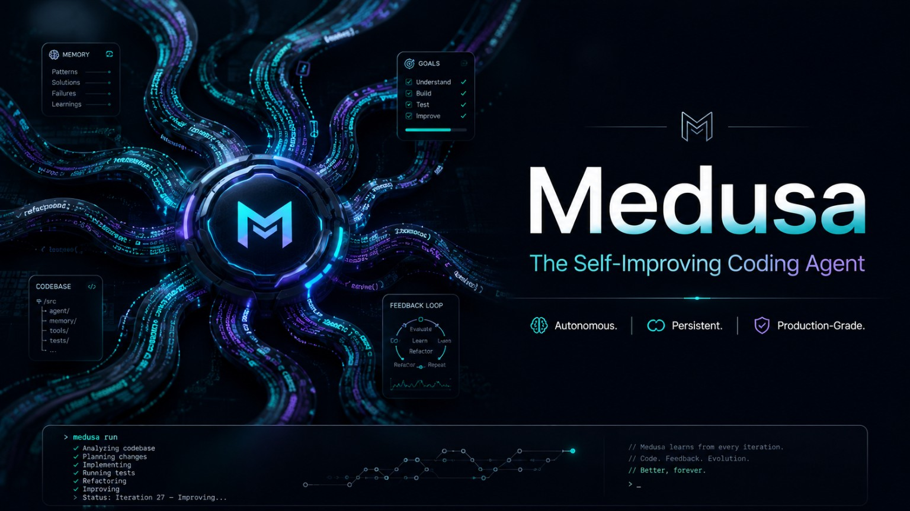

<p align="center">
  
</p>

# Medusa

A local-first, repository-aware coding agent written in Rust. Medusa inspects real codebases, turns objectives into explicit plans, coordinates bounded specialist agents, isolates mutations in Git worktrees, edits files, runs guarded commands, verifies results, preserves durable evidence, and resumes work across the CLI, terminal UI, desktop app, daemon, and Telegram.

The product model is **Plan, Execute Safely, Recover**:

- **Plan.** An objective and repository context become explicit task contracts and a reviewable plan.
- **Execute Safely.** Read-only teammates scout the change; a worktree-isolated implementer mutates only inside its own branch; integration is guarded and rolls back on conflict.
- **Recover.** Sessions, plans, events, approvals, worker leases, commits, and verification live under `.medusa` as authoritative state. Interruption, cancellation, or crash never gets rewritten as success.

**Status (v1.0.0, `main`):** CLI, TUI, desktop application, daemon, shared runtime, bounded multi-agent execution, worktree-isolated mutation, platform containment, durable sessions, browser verification, voice interaction foundations, and the Telegram frontend are shipped and verified against the canonical capability ledger (`docs/CAPABILITY-CLAIMS.json`).

**Out of scope today:** unconstrained dynamic agent teams, autonomous nested delegation, consensus voting, distributed multi-worker transactions, and an authenticated OpenAI Realtime endpoint on the ChatGPT OAuth gateway. See [Roadmap](#roadmap) for the open work.

---

## Contents

- [Why Medusa](#why-medusa)
- [Interfaces](#interfaces)
- [Installation](#installation)
- [First run](#first-run)
- [Quick start](#quick-start)
- [Configuration](#configuration)
- [Capabilities and strengths](#capabilities-and-strengths)
- [Architecture](#architecture)
- [Safety and containment](#safety-and-containment)
- [Persistent state and recovery](#persistent-state-and-recovery)
- [Platform support](#platform-support)
- [Current limitations](#current-limitations)
- [Roadmap](#roadmap)
- [Project documentation](#project-documentation)
- [Development](#development)
- [License](#license)

## Why Medusa

Medusa combines an interactive coding product with explicit execution boundaries.

- **Repository-native.** File, search, Git, command, browser, attachment, memory, and verification capabilities operate around a selected repository, not an unrestricted machine-wide shell.
- **Plan, execute safely, recover.** Objectives become task contracts; mutating work is isolated; integration is guarded; failures and interruptions preserve evidence instead of being rewritten as success.
- **Verified completion.** A model response, edit, commit, or cherry-pick is not enough. Coding completion is decided by the configured repository verification gate.
- **Bounded multi-agent coordination.** The production path uses read-only planning and risk-review teammates plus one worktree-isolated implementer when mutation is required. The parent remains a read-only lead and reviewer.
- **Safe by default.** Repository writes are path-checked, symlink-aware, and transactional. Commands are policy-checked and executed through platform containment that fails closed when unavailable.
- **Durable and inspectable.** Sessions, plans, events, approvals, verification evidence, worker receipts, transactions, memory, checkpoints, and recovery state live under `.medusa`.
- **One runtime, multiple frontends.** CLI, TUI, desktop, daemon clients, and Telegram use the same shared runtime and protocol authorities instead of creating separate agents.
- **Cross-platform Rust core.** The workspace contains ~58 focused crates and is tested across Linux, macOS, and Windows.

## Interfaces

The interface changes presentation and interaction style; it does not create a separate policy engine, transcript, or repository authority.

| Interface | Status | Best for |
|---|---|---|
| **CLI** | Shipped | Automation, CI/CD, scripts, diagnostics, repository utilities, headless objectives. |
| **Terminal UI (TUI)** | Shipped | Interactive coding, plans, questions, approvals, activity, sessions, attachments, recovery, metrics, keyboard-first workflows. |
| **Desktop application** | Shipped | A graphical multi-pane workspace with sessions, chat, plans, activity, settings, review, attachments, and voice controls. |
| **Telegram frontend** | Shipped | Remote session attachment, mobile status and control, approvals, progressive rendering, files, voice notes, and the Mini App voice surface. |
| **Daemon** | Shipped | Bounded concurrency, reconnect, cancel-and-drain, IPC control plane for other clients. |
| **Full-duplex voice** | Foundation shipped | Provider-neutral realtime core; usable wherever a supported authenticated Realtime route is available. |

### CLI

Run a headless objective:

```bash
medusa run "Fix the failing tests and verify the result"
```

For unattended approval of known shell commands, provide one exact command per line:

```text
# .medusa/approve.txt
cargo test --workspace
cargo fmt --all -- --check
```

```bash
medusa run \
  --non-interactive \
  --approve-allowlist .medusa/approve.txt \
  "Fix the failing tests and verify the result"
```

The allowlist does not bypass policy. Medusa still validates the exact action, active plan, containment, command restrictions, approval scope, and expiry.

Other commands:

```bash
medusa doctor
medusa migrate
medusa update --check
medusa update
medusa search "RuntimeController"
medusa shell cargo test --workspace
medusa checkpoint "before refactor"
medusa resume <session-id>
```

### Terminal UI

Open the interactive terminal:

```bash
cd /path/to/repository
medusa
```

Useful entry options:

```bash
medusa --repo /path/to/repository
medusa --prompt "Inspect the failures and propose the smallest safe fix"
medusa --continue
medusa --resume <session-id>
medusa --fresh
```

The TUI presents the shared runtime event stream as a conversation and activity timeline. It supports plans, questions, approvals, queued follow-ups, cancellation, session resume, settings, usage metrics, clipboard/file/image attachments, recovery views, team activity, and realtime voice controls.

### Desktop application

The desktop app is a Tauri/React shell over the same Medusa runtime. It provides session navigation, a central execution timeline, plan and activity presentation, provider and runtime status, settings, attachments, review and learning surfaces, and desktop-native voice controls.

### Telegram

Telegram is a frontend to the same authoritative Medusa session, not a separate bot-owned agent. The Telegram frontend closes issue [#568](https://github.com/benclawbot/Medusa/issues/568) and ships the Hermes-style rendering, action card, approval, and full-duplex voice Mini App surface.

Shipped today:

- versioned frontend command and presentation-event contracts;
- default-deny authorization using numeric Telegram identities;
- idempotent command mapping and replay-safe renderer foundations;
- MarkdownV2 escaping, UTF-16-aware splitting, tables, plans, teams, activities, questions, approvals, artifacts, completion, cancellation, and failure rendering;
- opaque, expiring, one-shot approval callbacks;
- durable chat/topic/user bindings, update offsets, event cursors, display preferences, and voice-mode preferences;
- routing through the daemon frontend control plane and shared runtime session authority;
- Telegram-native voice notes and TTS voice bubbles;
- authenticated Mini App access to the shared full-duplex voice session.

See [Telegram](docs/TELEGRAM.md) for setup, service operation, and Mini App wiring.

### Full-duplex voice

Medusa has one provider-neutral realtime voice model rather than a separate voice agent for each frontend. It includes bounded input/output audio queues, partial and final transcripts, voice activity, tool and approval states, reconnect behavior, deterministic resource cleanup, and barge-in that stops spoken output without implicitly cancelling the coding task.

| Surface | Capability |
|---|---|
| **TUI** | Full-duplex controller with `/voice`, `/voice off`, `/mute`, `/unmute`, `/stop-speech`, `/cancel-response`, and `/cancel-task`. Hold Space focuses capture without ending duplex mode. Unsupported SSH, container, WSL, CI, or headless audio environments are reported explicitly. |
| **Desktop** | Compact voice entry beside the composer, explicit microphone permission, mute and speaker controls, device selection, refresh/reconnect, transcripts, transmitting state, barge-in, and deterministic track/transport cleanup. |
| **Telegram** | Durable voice-mode preferences, voice notes, TTS voice bubbles, and the authenticated Mini App exposing the shared full-duplex voice session. |

The provider transport is capability-gated. The current local `openai-oauth` ChatGPT/Codex gateway exposes text endpoints but not an authenticated Realtime endpoint. Medusa refuses microphone streaming on that route and does not request a separate voice API key. The shared voice core and frontend controls remain ready for a supported authenticated route.

## Installation

### Prerequisites

- Git
- Rust 1.88 or newer; the repository pins Rust 1.88.0
- A supported model connection
- Node.js 22 for ChatGPT OAuth, browser verification, desktop development, or desktop packaging
- The platform containment backend required for guarded shell execution

### Install the CLI from `main`

```bash
cargo install --git https://github.com/benclawbot/Medusa.git --locked medusa-cli
```

Confirm installation:

```bash
medusa --version
medusa doctor
```

### Install from a local checkout

```bash
git clone https://github.com/benclawbot/Medusa.git
cd Medusa
cargo install --path crates/medusa-cli --locked
medusa doctor
```

### Desktop packages

The release workflow produces unsigned packages for:

- **Linux:** Debian package and AppImage
- **macOS:** application archive and DMG
- **Windows:** NSIS installer

Release assets remain draft-only until a maintainer reviews packages, checksums, SBOM, and provenance. Windows packages are not Authenticode-signed, macOS packages are not Developer ID signed or notarized, and Linux packages are not distributed through a signed package repository.

For desktop development, install Node.js 22 and use the scripts under `apps/medusa-desktop`.

### Telegram

The Telegram frontend ships under the daemon. Setup, service operation, Mini App wiring, and live acceptance are documented in [Telegram](docs/TELEGRAM.md).

## First run

Run Medusa inside a repository:

```bash
cd /path/to/project
medusa
```

The first interactive launch asks for a model connection and stores the non-secret profile in the user configuration directory:

- Linux and macOS: `${XDG_CONFIG_HOME:-~/.config}/medusa/provider.toml`
- Windows: `%APPDATA%\medusa\provider.toml`

API keys are read from the environment and are not written to `provider.toml`.

Direct provider routes include:

| Route | Credential |
|---|---|
| MiniMax | `MINIMAX_API_KEY` |
| Anthropic | `ANTHROPIC_API_KEY` |
| Anthropic-compatible endpoint | `MEDUSA_API_KEY`, optionally `MEDUSA_BASE_URL` |

The setup and provider layer also support configured OpenAI-compatible gateways, local model runtimes, OmniRoute, the OpenAI API, and ChatGPT OAuth where their advertised capabilities meet the selected workflow.

ChatGPT OAuth is supplied through the separately distributed `openai-oauth` loopback gateway:

```bash
npx --yes openai-oauth@latest --detach
```

Medusa expects the gateway at `127.0.0.1:10531`. The gateway owns the OAuth credential; Medusa does not read its credential file.

## Quick start

Open an interactive session:

```bash
medusa
```

Start with an objective:

```bash
medusa --prompt "Fix the failing tests and verify the result"
```

Work in another repository:

```bash
medusa --repo /path/to/project
```

Resume or continue:

```bash
medusa --resume <session-id>
medusa --continue
```

Run headlessly:

```bash
medusa run "Review this repository for the cause of the failing integration test"
```

Maintenance:

```bash
medusa doctor
medusa migrate
medusa update --check
```

`medusa update --check` is read-only. Source-installed binaries can update from a verified immutable commit on `main`; package-managed installations are not overwritten and instead report the relevant package-manager command.

## Configuration

Medusa uses typed TOML configuration with unknown fields denied. Configuration precedence is:

```text
CLI --set overrides
  > environment overrides
  > project TOML
  > user TOML
  > built-in defaults
```

Supported runtime configuration currently includes:

```toml
version = 1

[agent]
mode = "yolo"
max_turns = 500
parallel_workers = 4

[model]
provider = "minimax"
fallback_providers = []
# Optional role/phase pins to existing route ids, for example { planner = "primary" }
role_routes = {}
name = "MiniMax-M3"
protocol = "openai"
temperature_milli = 200
max_output_tokens = 32768
context_window_tokens = 1000000
auto_compact_percent = 40
auth = "api-key"
# base_url = "https://example.invalid/v1"

[memory]
enabled = true
format = "markdown"

[verification]
required = true
browser_on_ui_change = true
```

`agent.parallel_workers` controls bounded parallel tool work in schema version 1; it does not create unconstrained independent coding agents.

Command-line overrides use `--set key=value`:

```bash
medusa --set agent.mode=read-only
medusa --set agent.max_turns=100
medusa --set verification.browser_on_ui_change=false
```

### Configuration commands

```bash
medusa config init
medusa config show
medusa config show --json
medusa config edit
medusa config get model.provider
medusa config set model.provider minimax
medusa config unset model.base_url
medusa config validate
medusa config validate --json
medusa config doctor
medusa config doctor --json
medusa config reset
```

Named profiles:

```bash
medusa config profiles list
medusa config profiles create work
medusa config profiles use work
medusa config profiles delete work
```

Fallback providers are complete routes with their own provider, model, protocol, endpoint, authentication, capability, and retry settings. A fallback does not silently inherit credentials or request-specific fields from the primary route.

See [Configuration](docs/CONFIGURATION.md) for the canonical supported schema and migration notes.

## Capabilities and strengths

The 10 capabilities below are recorded as `production` maturity in [`docs/CAPABILITY-CLAIMS.json`](docs/CAPABILITY-CLAIMS.json). Each claim links to its owner, production code paths, test paths, gates, entrypoints, supported platforms, and promotion checklist.

| # | Capability | Maturity |
|---|---|---|
| 1 | Shared runtime — TUI, desktop, and headless interfaces share one frontend-neutral runtime. | production |
| 2 | Durable sessions & memory — sessions, prompts, memory, provenance, lifecycle, recall. | production |
| 3 | GitHub service — guarded auth and repo workflow operations through a service boundary. | production |
| 4 | Provider context resilience — config, retries, failover, capability authority, context accounting, compaction. | production |
| 5 | Identity, approval, transactions — exact-action approvals, transaction rollback, durable decisions. | production |
| 6 | Daemon — bounded concurrency, reconnect, cancellation, process-tree termination, graceful drain, recovery. | production |
| 7 | Release trust — validated artifacts, checksums, SBOMs, provenance attestations, draft-only publication. | production |
| 8 | Self-update — verified immutable-main updates that respect package-manager ownership. | production |
| 9 | Multi-agent research — read-only planner and risk reviewer, plus one worktree-isolated implementer for explicit mutation. | production |
| 10 | Truthful code-intelligence levels — per-language semantic depth, repository-scoped TypeScript/JavaScript semantics, guarded rename. | production |

### Repository intelligence

- repository and file discovery;
- bounded text and symbol search;
- repository context retrieval and turn assembly;
- goals, progress, confidence, continuation, escalation, and failure tracking;
- changed-symbol and affected-file analysis;
- targeted verification selection with broader fallback checks.

### Agent execution

- durable sessions and objectives;
- explicit plans and task contracts;
- read-only planner and risk-review teammates;
- one worktree-isolated mutating implementer when required;
- durable worker leases, epochs, task evidence, and cleanup;
- deterministic guarded integration and rollback on conflict;
- a read-only parent lead/reviewer and authoritative repository verification gate.

### Tools and integrations

- guarded repository file operations;
- Git-aware change and integration workflows;
- policy-controlled command execution;
- browser verification through the Playwright sidecar;
- image and file prompt attachments when provider capabilities permit them;
- MCP and extension boundaries;
- provider routing and fallback chains;
- GitHub, browser, update, and optional Desktop Commander integrations.

### Verification

After mutation, Medusa can:

- inspect changed paths and public API risk;
- select impacted checks when semantic evidence is sufficient;
- run broader checks when a narrow selection would be unsafe;
- require browser verification for effective UI changes;
- record commands, assertions, routes, screenshots, console errors, overrides, and results;
- reject completion when required evidence is absent or failed.

### Memory and learning

- repository-scoped Markdown memory;
- bounded recall with provenance;
- memory consolidation and writeback;
- verified-session learning and probationary lessons;
- failure history and negative skill outcomes;
- no promotion of optimistic or unverified completion claims as successful experience.

### Observability and resilience

- typed runtime events shared by frontends;
- usage, progress, activity, team, plan, question, completion, cancellation, failure, and recovery state;
- process registry and runtime supervision;
- checkpoints, replay, time-travel, transaction, and continuity foundations;
- deterministic cancellation and resource cleanup;
- privacy-safe evidence and diagnostics.

## Architecture

<p align="center">
  
</p>

The canonical production path is:

```text
CLI / TUI / Desktop / daemon frontend / Telegram
  -> typed frontend command
  -> RuntimeController
  -> production task contracts
  -> MultiAgentCoordinator
  -> read-only planner and risk reviewer
  -> worktree-isolated implementer when mutation is required
  -> guarded integration
  -> read-only parent review
  -> repository verification gate
  -> typed events and durable evidence
```

### Major layers

| Layer | Responsibilities | Principal crates |
|---|---|---|
| **Interfaces** | CLI parsing, terminal interaction, desktop UI, Telegram command/rendering | `medusa-cli`, `medusa-tui`, `apps/medusa-desktop`, daemon Telegram modules |
| **Runtime authority** | Session lifecycle, commands, events, coordination, completion, cancellation | `medusa-runtime`, `medusa-agent`, `medusa-daemon` |
| **Multi-agent execution** | Task contracts, scheduling, leases, isolated implementation, parent review | `medusa-multi-agent-scheduler`, `medusa-workers`, `medusa-worker-leases`, runtime coordinators |
| **Context and intelligence** | Repository context, retrieval, turn assembly, goals, progress, confidence, failure | context and intelligence crate families |
| **Tools and policy** | Capability discovery, authorization, execution control, Git/browser/extensions | `medusa-capabilities`, policy, control, extension, GitHub, and browser crates |
| **State and recovery** | Sessions, checkpoints, replay, time travel, continuity, transactions, recovery | checkpoint, replay, time-travel, continuity, transaction, recovery crates |
| **Memory and improvement** | Markdown memory, consolidation, writeback, learning, hardening | memory, improvement, and hardening crate families |
| **Containment** | Platform sandboxing, process ownership, limits, cleanup | `medusa-process-containment`, `medusa-process-registry`, `medusa-runtime-supervisor` |
| **Protocol and providers** | Typed frontend/event contracts, model routes, Realtime voice contracts | `medusa-protocol`, `medusa-provider`, `medusa-openai-realtime` |

For source-level ownership, see [Product architecture](docs/ARCHITECTURE.md), [Production execution trace](docs/PRODUCTION-EXECUTION-TRACE.md), and [Contributor architecture](docs/CONTRIBUTOR-ARCHITECTURE.md).

## Safety and containment

Medusa is intentionally not an unrestricted shell replacement.

### Repository writes

Writes are resolved against the selected repository, symlink-aware, policy checked, transactional, and recorded with evidence and rollback information. Sensitive locations remain denied, including `.git` internals, credential stores, operating-system configuration and executable paths, and login-persistence locations.

### Command containment

Shell execution fails closed if the platform backend is unavailable:

- **Linux:** Bubblewrap
- **macOS:** Seatbelt
- **Windows:** Windows 11 composable sandbox API with repository read/write binding, toolchain read-only binding, network denial, environment allowlisting, and Job Object limits

Windows command containment requires Windows 11 with `Experimental_CreateProcessInSandbox`. There is no unsandboxed fallback through that API.

### Approvals

Approvals are bound to structured actions and current runtime state. Exact command allowlists, interactive approve-once decisions, Telegram callback foundations, expiry, idempotency, and plan fingerprints do not weaken the underlying policy or containment boundary.

### Cancellation and cleanup

Cancellation propagates through runtime, model, tool, process, worker, and frontend state. Process ownership and containment are designed to terminate child process trees and preserve durable cancellation or failure evidence.

## Persistent state and recovery

Repository-local state lives under `.medusa`. Durable authority categories include:

- sessions, objectives, messages, and typed events;
- plans, task contracts, questions, and approvals;
- model, tool, integration, and verification evidence;
- worker leases, epochs, worktrees, changed paths, and commit receipts;
- checkpoints, snapshots, replay, and time-travel state;
- process, cancellation, transaction, and rollback records;
- failure history and recovery decisions;
- Markdown memory, recall, lessons, and skill outcomes;
- daemon and frontend continuity records.

Resume and recovery never treat display text or an optimistic model response as authoritative execution evidence.

## Platform support

Canonical workflows test the Rust workspace and daemon behavior across Linux, macOS, and Windows. Desktop CI builds and validates unsigned packages on all three platforms.

Repository gates cover formatting, Clippy, tests, documentation, dependency and security policy, architecture drift, containment regressions, adversarial cases, fuzz smoke tests, migration and chaos recovery, package smoke tests, and selected live-provider scenarios.

Platform support does not imply identical containment, audio, browser, credential-store, or operating-system signing behavior.

## Current limitations

- The current ChatGPT/Codex OAuth gateway does not expose an authenticated OpenAI Realtime endpoint; microphone streaming fails closed even though the shared voice core, TUI/desktop controls, and Telegram Mini App surface are shipped.
- ChatGPT OAuth depends on the separately distributed `openai-oauth` gateway and Node.js.
- Browser verification depends on Node.js, the Playwright sidecar, and a reachable development route.
- Native Anthropic-compatible provider requests are currently non-streaming even though streaming is represented in capability contracts.
- Screenshot input is accepted only when the selected provider declares compatible image support and limits.
- Desktop release packages are unsigned at the operating-system level.
- Windows command containment requires the Windows 11 composable sandbox API.
- The production coordinator intentionally supports a bounded teammate set and one mutating implementer contract rather than unconstrained dynamic agent teams.

## Roadmap

Open work is tracked in repository issues. The four numbered roadmap items from the previous README cycle are closed and shipped — see [issue #555](https://github.com/benclawbot/Medusa/issues/555) (product presentation), [#568](https://github.com/benclawbot/Medusa/issues/568) (Telegram frontend), [#569](https://github.com/benclawbot/Medusa/issues/569) (durable journal and continuity), and [#574](https://github.com/benclawbot/Medusa/issues/574) (unified configuration UX).

The active roadmap groups open issues by priority.

### Performance — [#684](https://github.com/benclawbot/Medusa/issues/684)

Make Medusa the fastest coding agent measured by time from accepted objective to a correct, independently verified repository result, not by earliest unverified edit or raw token generation speed.

Children:

- [#689](https://github.com/benclawbot/Medusa/issues/689) Pipeline verification continuously with warm build, dependency, and worktree resources.
- [#690](https://github.com/benclawbot/Medusa/issues/690) Bounded speculative implementation with immediate invalidation and waste controls.
- [#691](https://github.com/benclawbot/Medusa/issues/691) Conflict-aware parallel mutating implementers with deterministic integration.
- [#692](https://github.com/benclawbot/Medusa/issues/692) Optimize durable journal persistence and runtime hot paths without weakening recovery.

### Reliability, privacy, and resilience

- [#776](https://github.com/benclawbot/Medusa/issues/776) Repository-wide fuzz, chaos, and crash-resilience certification.
- [#778](https://github.com/benclawbot/Medusa/issues/778) Production operational reliability, diagnostics, and degraded-mode certification.
- [#777](https://github.com/benclawbot/Medusa/issues/777) Data lifecycle, privacy, retention, redaction, export, and deletion across all durable state.

### Long-context delegation, time travel, and memory

- [#758](https://github.com/benclawbot/Medusa/issues/758) Contained persistent analysis workspace with context-as-data and typed recursive delegation.
- [#755](https://github.com/benclawbot/Medusa/issues/755) Provenance-linked semantic summaries for abandoned time-travel branches.
- [#754](https://github.com/benclawbot/Medusa/issues/754) Compaction Manifest V2 with authoritative state, semantic history, and intact recent turns.

### Skills, refinement, and observability

- [#760](https://github.com/benclawbot/Medusa/issues/760) Typed executable skill packages with contained runners, provenance, and verification.
- [#759](https://github.com/benclawbot/Medusa/issues/759) Evidence-gated continual refinement with immutable policy roots and rollback.
- [#757](https://github.com/benclawbot/Medusa/issues/757) Route scheduled and wakeup prompts through the durable session action plane.
- [#756](https://github.com/benclawbot/Medusa/issues/756) Read-only live-session observer and non-invasive side-question API.

### Manual live acceptance

- [#719](https://github.com/benclawbot/Medusa/issues/719) OpenAI Realtime voice and Telegram end-to-end proof.

### Deferred

- [#771](https://github.com/benclawbot/Medusa/issues/771) Final architecture concentration hardening after the active issue queue is complete.

## Project documentation

- [Product architecture](docs/ARCHITECTURE.md)
- [Contributor architecture](docs/CONTRIBUTOR-ARCHITECTURE.md)
- [Production execution trace](docs/PRODUCTION-EXECUTION-TRACE.md)
- [Configuration](docs/CONFIGURATION.md)
- [Capability claims](docs/CAPABILITY-CLAIMS.json)
- [Capability evidence](docs/CAPABILITY-EVIDENCE.md)
- [Benchmarks](docs/BENCHMARKS.md)
- [Observability](docs/OBSERVABILITY.md)
- [Security hardening](docs/SECURITY-HARDENING.md)
- [Desktop distribution](docs/DESKTOP-DISTRIBUTION.md)
- [Release process](docs/RELEASE.md)
- [Release compatibility](docs/COMPATIBILITY.md)
- [Telegram](docs/TELEGRAM.md)

## Development

Use the pinned toolchain and run the gates relevant to the change:

```bash
cargo fmt --all -- --check
cargo clippy --workspace --all-targets --all-features --locked -- -D warnings
cargo test --workspace --all-features --locked
cargo doc --workspace --all-features --no-deps
```

Architecture or capability changes must also pass:

```bash
python3 scripts/check-product-architecture.py
python3 scripts/check-capability-evidence.py
```

Frontend and desktop changes must pass the checks defined under `apps/medusa-desktop` and the desktop workflow. Telegram changes must preserve shared runtime authority, numeric authorization, callback replay safety, idempotency, redaction, and deterministic renderer tests.

## License

MIT.
