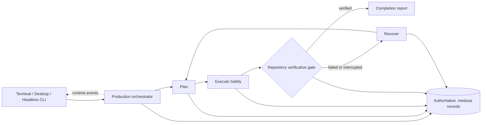
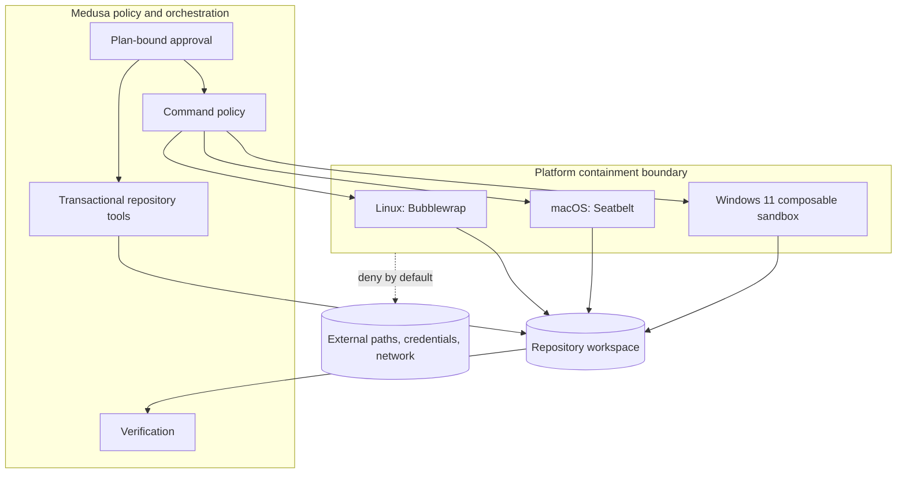
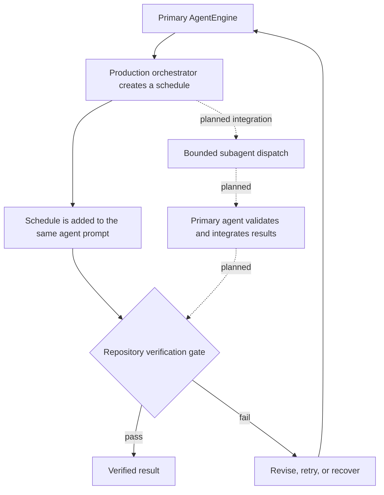
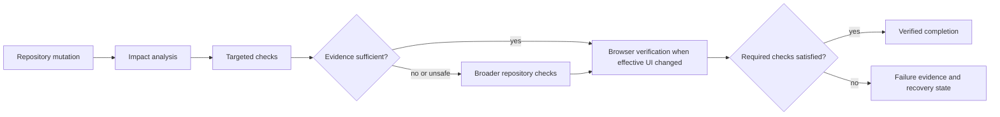
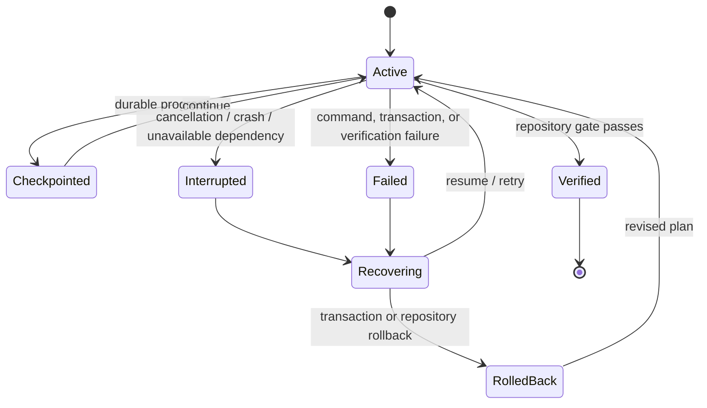

# Medusa Product Architecture

Medusa's product model is **Plan, Execute Safely, Recover**. The Rust crate graph is an implementation map, not the user-facing architecture.

## One-page orientation

| Product concept | User-visible responsibility | Completion evidence |
|---|---|---|
| **Plan** | Turn an objective and repository context into an explicit, reviewable plan. | Persisted plan state and plan-bound approvals. |
| **Execute Safely** | Apply guarded changes and run commands inside the platform containment boundary. | Runtime events, transactions, command evidence, and repository verification. |
| **Recover** | Preserve enough authoritative state to resume, retry, roll back, or explain failure without inventing success. | Checkpoints, journals, failure history, replay data, and recovery decisions. |

The production runtime entrypoint is `medusa-runtime::production_orchestrator`. Terminal, desktop, and headless interfaces feed objectives into that shared runtime. The repository verification gate is authoritative for coding completion. The recovery coordinator and persisted `.medusa` state provide the continuation path after interruption or failure.

## Runtime event flow

Runtime events are the shared frontend contract. Frontends render plans, questions, approvals, tool activity, failures, verification, and completion; they do not independently redefine provider capabilities, execution policy, or completion.

## Containment trust boundary

Repository writes are path-checked, symlink-aware, and transactional. Shell execution fails closed when the required containment backend is unavailable. External paths and dangerous operations remain denied unless an exact, policy-valid action is permitted; approval does not disable containment.

Platform note: Windows command containment requires Windows 11 with `Experimental_CreateProcessInSandbox`. Browser verification requires Node.js, the Playwright sidecar, and a reachable route. These are shipped but platform- or prerequisite-limited behaviors, not universal fallbacks.

## Orchestration and parent/subagent responsibility

**Current shipped behavior:** orchestrated coding objectives still run through one `AgentEngine`. The production orchestrator plans work, emits scheduling events, and supplies that schedule to the same agent. Scheduler, worker, and parent/subagent result APIs exist as implementation scaffolding, but production `run_prompt` does not yet dispatch subagents.

**Planned delegation contract:** when subagent execution is wired into the production runtime, the primary agent remains accountable for checking evidence, resolving conflicts, integrating accepted work, and presenting the combined repository state to the verification gate. Delegation will never transfer completion authority.

## Verification gate

Successful model output is not successful repository work. A coding session is complete only after the configured repository verification requirements are satisfied. Missing prerequisites produce explicit failure evidence rather than a false pass.

## Recovery-state lifecycle

Recovery is evidence-preserving. Failed sessions retain failure history and negative outcomes; they are not promoted into successful learning. Checkpoints, transaction journals, repository snapshots, replay records, and recovery decisions support continuation and rollback.

## Authoritative persisted records

Repository-local durable state lives under `.medusa`. Exact filenames and schemas are implementation details owned by the mapped crates; the authority categories are stable:

| Concern | Authoritative record | Authority rule |
|---|---|---|
| Plans | Persisted session plan and current plan fingerprint | Approvals and execution must bind to the active plan. |
| Execution | Runtime event log, tool activity, transactions, changed paths, process records | Proposed text is not execution evidence. |
| Verification | Verification commands, results, browser evidence, overrides, and completion status | Required verification decides coding completion. |
| Reports | Final session report derived from runtime and verification evidence | Reports summarize records; they do not override them. |
| Learning | Provenance-bearing Markdown lessons, recall records, and skill outcomes | Only verified outcomes can become accepted positive learning. |
| Recovery | Checkpoints, failure history, transaction journals, snapshots, replay and recovery decisions | Recovery preserves failed and interrupted states rather than rewriting them as success. |

## Capability evidence and drift control

Every production capability presented here must map to shipped production paths, executable tests, and canonical repository gates in [`CAPABILITY-CLAIMS.json`](CAPABILITY-CLAIMS.json) and [`CAPABILITY-EVIDENCE.md`](CAPABILITY-EVIDENCE.md). Run both `python3 scripts/check-product-architecture.py` and `python3 scripts/check-capability-evidence.py` after changing architecture or capability claims. The first validates architecture headings, diagrams, workspace metadata, contributor paths, and README links; the second validates required documents, evidence paths, gates, and ledger synchronization. Experimental, planned, or prerequisite-limited behavior must be labelled where it appears.

For crate-level ownership and entrypoints, see [Contributor architecture map](CONTRIBUTOR-ARCHITECTURE.md).
