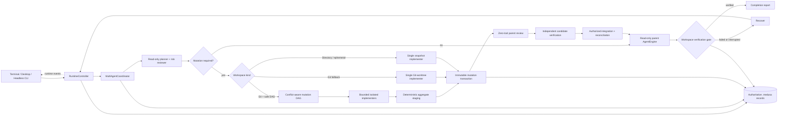
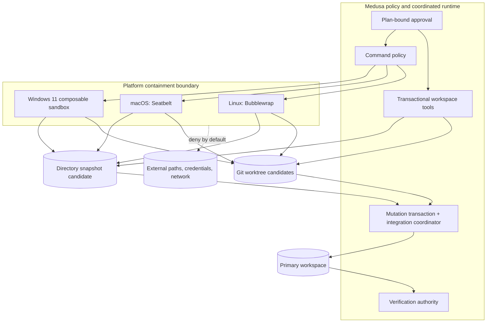
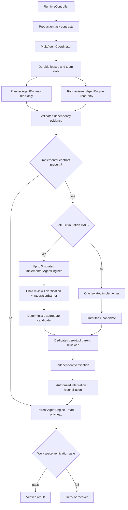
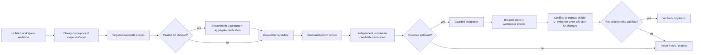
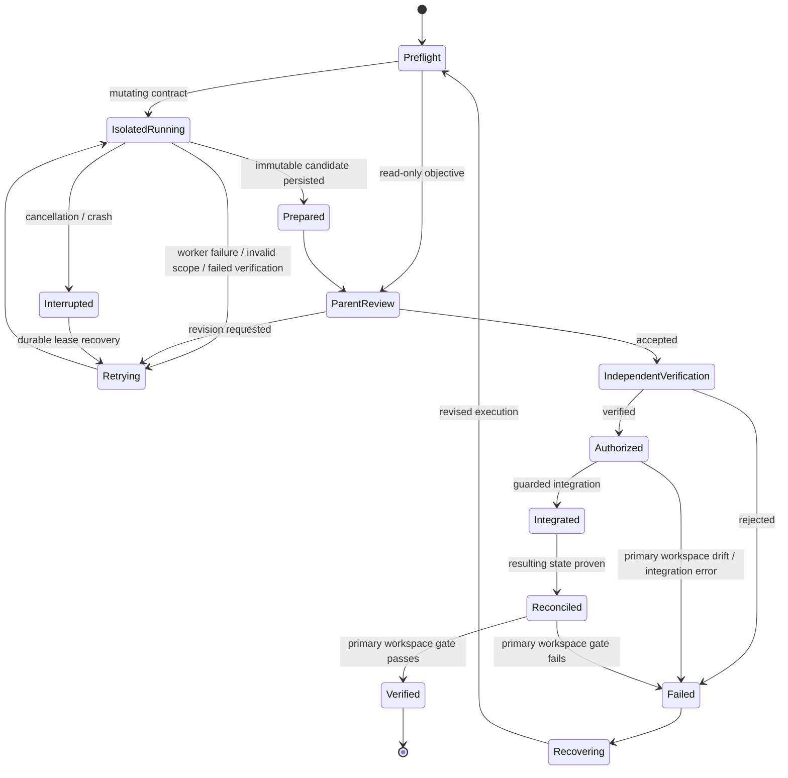

# Medusa Product Architecture

Medusa's product model is **Plan, Execute Safely, Recover**. The Rust crate graph is an implementation map, not the user-facing architecture.

## One-page orientation

| Product concept | User-visible responsibility | Completion evidence |
|---|---|---|
| **Plan** | Turn an objective and workspace context into explicit task contracts and a reviewable plan. | Persisted plan state, task contracts, workspace fingerprints, and plan-bound approvals. |
| **Execute Safely** | Run read-only teammates, isolate mutating implementation, deterministically compose accepted parallel work when safe, and execute guarded commands inside containment. | Durable leases, isolated-worker receipts, immutable candidates, transactions, command evidence, and workspace verification. |
| **Recover** | Preserve enough authoritative state to resume, retry, roll back, or explain failure without inventing success. | Checkpoints, worker state, integration receipts, failure history, replay data, snapshots/commits, and recovery decisions. |

The coordinated production path is `medusa-runtime::RuntimeController -> run_prompt -> multi_agent_coordinator::run_preflight -> mutating_worker_coordinator::run_implementation when mutation is required -> workspace-specific isolated candidate preparation -> dedicated durable parent review -> independent verification -> authorization -> integration -> reconciliation`. Git workspaces may safely decompose implementation into a conflict-aware mutation DAG and deterministically aggregate accepted children. Directory workspaces use one isolated content-addressed snapshot implementer. Terminal, desktop, daemon, and headless interfaces use the shared runtime. The configured workspace verification gate is authoritative for completion. See [`PRODUCTION-EXECUTION-TRACE.md`](PRODUCTION-EXECUTION-TRACE.md) and [Workspace modes](WORKSPACES.md).

## Runtime event flow

Runtime events are the shared frontend contract. Frontends render plans, teammate activity, isolated-worker state, failures, verification, and completion; they do not independently redefine provider capabilities, execution policy, integration authority, or completion.

## Containment trust boundary

Workspace writes are path-checked, symlink-aware where supported, and transactional. Git implementers receive mutating tools only inside dedicated worktrees. Directory implementers receive a copied, content-addressed bounded workspace and directory mutation fails closed on symlinks. Changed paths are checked against task contracts and verification must pass on the immutable candidate before integration authorization. Primary-workspace drift invalidates integration rather than overwriting newer user work. Shell execution fails closed when the required containment backend is unavailable.

For Git parallel mutation, each child owns an exact path/resource contract. Resource conflicts include manifests, lockfiles, migrations, snapshots, and generated outputs. The coordinator runs only conflict-free waves, independently accepts children, establishes an `IntegrationBarrier`, stages them in deterministic dependency order, verifies the aggregate, and submits a single immutable aggregate transaction for final review. High-risk, ambiguous, oversized, low-confidence, or conflicting plans fall back to one implementer.

Platform note: Windows command containment requires Windows 11 with `Experimental_CreateProcessInSandbox`. Required UI-change verification uses the Node.js browser sidecar as an internal verification boundary; model-executable browser actions remain quarantined until their dispatcher, permissions, and authenticated behavioral evidence are certified.

## Orchestration and parent/subagent responsibility

**Current shipped behavior:** coordinated prompts dispatch independent read-only planner and risk-reviewer sessions. Explicit mutation then uses the workspace backend. A Git objective may dispatch up to three conflict-free implementation children when the typed decomposition passes production risk, confidence, exact-scope, and resource-conflict rules; otherwise it falls back to one worktree implementer. A directory or ephemeral objective uses one isolated content-addressed snapshot implementer. Every candidate remains subject to changed-scope validation, verification, dedicated zero-tool parent review, independent verification, integration authorization, guarded integration, and reconciliation. The parent remains a read-only lead and owns the final user-facing response and workspace verification gate.

**Delegation boundary:** parallel implementation is centrally scheduled, not recursively delegated. Only the root coordinator creates workers. Implementers cannot spawn implementers or expand their contracts. Autonomous nested delegation, unconstrained model-driven team expansion, consensus voting, distributed multi-host transactions, and non-Git parallel mutation remain outside the production entrypoint.

## Provider role routing and reasoning exchange

Provider selection remains one authority: `model.role_routes` may pin planner, implementer,
reviewer, repair, summarization, or formatting phases to existing `primary`/`fallback[index]`
profiles. A pin is attempted first and the normal authorized failover order remains available;
latency optimization and hedging do not silently replace a user-pinned route.

Cross-model context uses the provider-neutral `ReasoningHandoffV1` contract. It contains bounded,
visible decision state, evidence references, verification receipts, risks, and next actions with
trust and sensitivity metadata. Transfer policy can be `none`, `evidence_only`,
`decisions_and_evidence`, `structured`, or conservative `auto`; independent review omits source
decisions. Provider-native continuation bytes use the separate `ProviderContinuationState`, which
is exact provider/protocol/route/model/session bound by default, is redacted from debug and
serialization, and has no provider-neutral transcript or prompt rendering path. Unsupported or
incompatible continuation state fails closed rather than being replayed across models or providers.

## Verification gate

Successful model output, a worker candidate, or an integration operation is not successful workspace work. A coordinated mutation is complete only after isolated verification, parent review, independent verification, authorization, guarded integration/reconciliation, and configured primary-workspace verification requirements are satisfied. Missing prerequisites produce explicit failure evidence rather than a false pass.

For artifact-oriented directory work where no project-specific verification command exists, the runtime truthfully records that no project-level command was declared; it still verifies candidate identity, changed scope, parent acceptance, independent materialization, authorized integration, and resulting tree identity. A `verify.sh`, `verify.ps1`, or recognized project verification path strengthens this gate when present.

## Recovery-state lifecycle

Recovery is evidence-preserving. Git prepared commits can be recognized after a crash by ancestry or exact tree identity. Directory prepared candidates are recognized by content-addressed snapshot/tree identity. Interrupted leases receive a new epoch. Git integration rolls back to the pre-batch HEAD on conflict; directory integration restores changed primary paths from a rollback copy if application fails. Temporary isolated workers are cleaned after acceptance or rejection while durable receipts and candidate evidence remain under `.medusa`.

## Authoritative persisted records

Workspace-local durable state lives under `.medusa`. Exact filenames and schemas are implementation details owned by the mapped crates; the authority categories are stable:

| Concern | Authoritative record | Authority rule |
|---|---|---|
| Plans | Persisted session plan, task contracts, mutation DAG where applicable, and current plan fingerprint | Execution must bind to the active plan. |
| Execution | Runtime event log, team state, leases, isolated-worker state, changed components, immutable candidates, transactions, and process records | Proposed text is not execution evidence. |
| Verification | Candidate checks, independent immutable-candidate checks, primary workspace checks, browser evidence, overrides, and completion status | Required verification decides completion. |
| Reports | Final session report derived from teammate, transaction, integration, and verification evidence | Reports summarize records; they do not override them. |
| Learning | Provenance-bearing Markdown lessons, recall records, and skill outcomes | Only verified outcomes can become accepted positive learning. |
| Recovery | Checkpoints, worker epochs, integration receipts, failure history, Git commits or directory snapshots, replay and recovery decisions | Recovery preserves failed and interrupted states rather than rewriting them as success. |

Persisted schedule or role labels alone must not be rendered as proof of dispatch. Production evidence is the combination of leased independent sessions, isolated candidate state where applicable, accepted transaction/integration receipts, and the final workspace verification gate.

Schema field names such as `prepared_commit` and `prepared_tree` remain stable for durable compatibility. In directory workspaces those fields contain content-addressed snapshot and tree identifiers, not Git object IDs.

## Capability evidence and drift control

Every production capability presented here must map to shipped production paths, executable tests, and canonical repository gates in [`CAPABILITY-CLAIMS.json`](CAPABILITY-CLAIMS.json) and [`CAPABILITY-EVIDENCE.md`](CAPABILITY-EVIDENCE.md). Git multi-implementer behavior is additionally certified by the cross-platform Parallel Mutation Certification workflow. Directory workspace mutation has cross-platform workspace-backend tests for isolation, immutable candidate preparation, independent materialization, drift rejection, integration, and cleanup. Run both `python3 scripts/check-product-architecture.py` and `python3 scripts/check-capability-evidence.py` after changing architecture or capability claims. Experimental, design-only, or prerequisite-limited behavior must be labelled where it appears.

For crate-level ownership and entrypoints, see [Contributor architecture map](CONTRIBUTOR-ARCHITECTURE.md).
