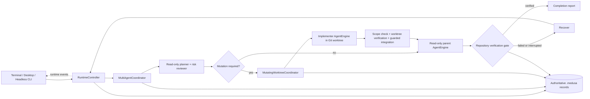
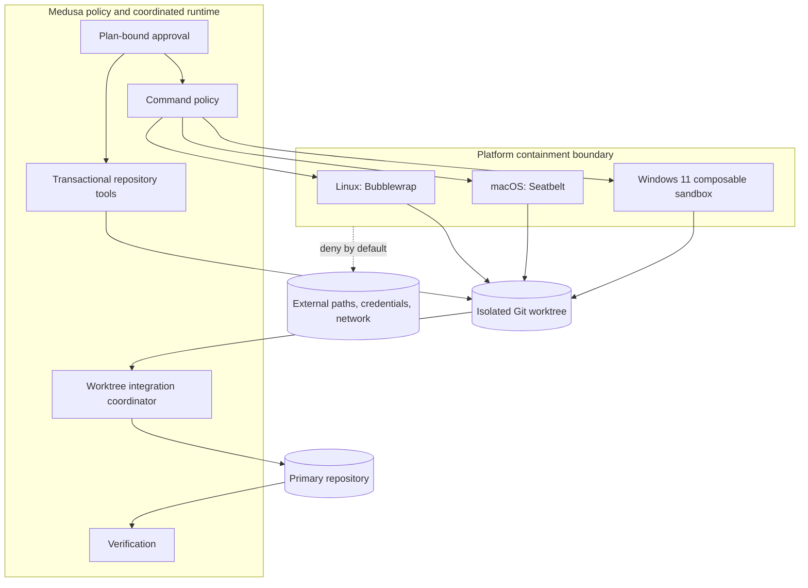
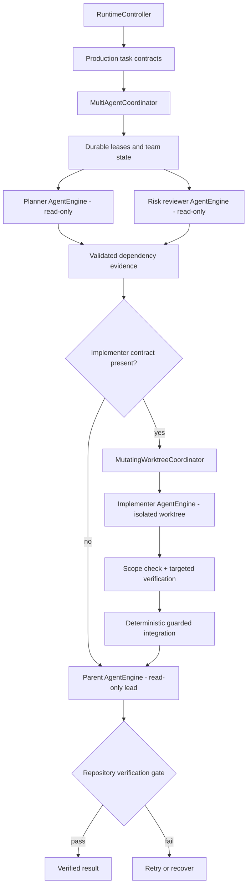
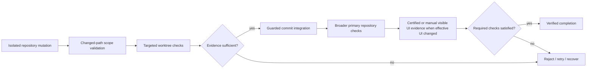
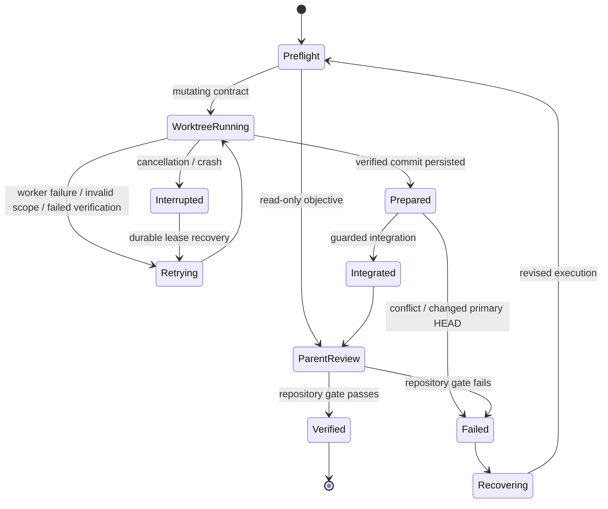

# Medusa Product Architecture

Medusa's product model is **Plan, Execute Safely, Recover**. The Rust crate graph is an implementation map, not the user-facing architecture.

## One-page orientation

| Product concept | User-visible responsibility | Completion evidence |
|---|---|---|
| **Plan** | Turn an objective and repository context into explicit task contracts and a reviewable plan. | Persisted plan state, task contracts, and plan-bound approvals. |
| **Execute Safely** | Run read-only teammates, isolate mutating implementation, integrate accepted commits, and execute guarded commands inside containment. | Durable leases, worktree receipts, transactions, command evidence, and repository verification. |
| **Recover** | Preserve enough authoritative state to resume, retry, roll back, or explain failure without inventing success. | Checkpoints, worker state, integration receipts, failure history, replay data, and recovery decisions. |

The coordinated production path is `medusa-runtime::RuntimeController -> run_prompt -> multi_agent_coordinator::run_preflight -> mutating_worker_coordinator::run_implementation when mutation is required -> read-only parent AgentEngine`. The implementer runs in an isolated Git worktree; the parent is a read-only lead and reviewer. Terminal, desktop, daemon, and headless interfaces use the shared runtime. The repository verification gate is authoritative for coding completion. See [`PRODUCTION-EXECUTION-TRACE.md`](PRODUCTION-EXECUTION-TRACE.md) for source-to-entrypoint proof.

## Runtime event flow

Runtime events are the shared frontend contract. Frontends render plans, teammate activity, worktree state, failures, verification, and completion; they do not independently redefine provider capabilities, execution policy, integration authority, or completion.

## Containment trust boundary

Repository writes are path-checked, symlink-aware, and transactional. Coordinated implementers receive mutating tools only inside their isolated worktree. Their changed paths are checked against the task contract, verification must pass inside the worktree, overlapping worker paths are rejected, and integration rollback restores the pre-batch HEAD on conflict. Shell execution fails closed when the required containment backend is unavailable.

Platform note: Windows command containment requires Windows 11 with `Experimental_CreateProcessInSandbox`. Required UI-change verification uses the Node.js browser sidecar as an internal verification boundary; model-executable browser actions remain quarantined until their dispatcher, permissions, and authenticated behavioral evidence are certified.

## Orchestration and parent/subagent responsibility

**Current shipped behavior:** coordinated prompts dispatch independent read-only planner and risk-reviewer sessions. Explicitly mutating objectives then dispatch one implementer session in an execution-specific Git worktree. The coordinator persists lease epochs and worker evidence, removes untracked runtime state, rejects out-of-scope paths, verifies the worktree, creates a deterministic commit, and integrates it with rollback on conflict. The parent is a read-only lead and reviewer and owns the final response and repository verification gate.

**Current boundary:** the shipped path supports the current single implementer contract. Autonomous nested delegation, model-driven dynamic team expansion, consensus voting, and distributed multi-worker transaction coordination remain outside the production entrypoint until separately promoted with behavioral and recovery proof.

## Provider role routing and reasoning exchange

Provider selection remains one authority: `model.role_routes` may pin planner, implementer,
reviewer, repair, summarization, or formatting phases to existing `primary`/`fallback[index]`
profiles. A pin is attempted first and the normal authorized failover order remains available;
latency optimization and hedging do not silently replace a user-pinned route.

Cross-model context uses the provider-neutral `ReasoningHandoffV1` contract. It contains bounded,
visible decision state, evidence references, verification receipts, risks, and next actions with
trust and sensitivity metadata. Transfer policy can be `none`, `evidence_only`,
`decisions_and_evidence`, `structured`, or conservative `auto`; independent review omits source
decisions. Provider-native continuation bytes use the separate `ProviderContinuationState`, which
is exact provider/protocol/route/model/session bound by default, is redacted from debug and
serialization, and has no provider-neutral transcript or prompt rendering path. Unsupported or
incompatible continuation state fails closed rather than being replayed across models or providers.

## Verification gate

Successful model output, a worktree commit, or a cherry-pick is not successful repository work. A coordinated coding session is complete only after worktree verification, guarded integration, and the configured primary repository verification requirements are satisfied. Missing prerequisites produce explicit failure evidence rather than a false pass.

## Recovery-state lifecycle

Recovery is evidence-preserving. A prepared commit can be recognized after a crash by ancestry or exact tree identity, interrupted leases receive a new epoch, and rejected integration rolls the primary repository back to its pre-batch HEAD. Temporary worktrees and branches are cleaned after acceptance or rejection while durable receipts remain under `.medusa`.

## Authoritative persisted records

Repository-local durable state lives under `.medusa`. Exact filenames and schemas are implementation details owned by the mapped crates; the authority categories are stable:

| Concern | Authoritative record | Authority rule |
|---|---|---|
| Plans | Persisted session plan, task contracts, and current plan fingerprint | Execution must bind to the active plan. |
| Execution | Runtime event log, team state, leases, worktree state, changed paths, commits, transactions, and process records | Proposed text is not execution evidence. |
| Verification | Worktree checks, primary repository checks, browser evidence, overrides, and completion status | Required verification decides coding completion. |
| Reports | Final session report derived from teammate, integration, and verification evidence | Reports summarize records; they do not override them. |
| Learning | Provenance-bearing Markdown lessons, recall records, and skill outcomes | Only verified outcomes can become accepted positive learning. |
| Recovery | Checkpoints, worker epochs, integration receipts, failure history, snapshots, replay and recovery decisions | Recovery preserves failed and interrupted states rather than rewriting them as success. |

Persisted schedule or role labels alone must not be rendered as proof of dispatch. Production evidence is the combination of leased independent sessions, worktree state where applicable, accepted integration receipts, and the final repository verification gate.

## Capability evidence and drift control

Every production capability presented here must map to shipped production paths, executable tests, and canonical repository gates in [`CAPABILITY-CLAIMS.json`](CAPABILITY-CLAIMS.json) and [`CAPABILITY-EVIDENCE.md`](CAPABILITY-EVIDENCE.md). Run both `python3 scripts/check-product-architecture.py` and `python3 scripts/check-capability-evidence.py` after changing architecture or capability claims. Experimental, design-only, or prerequisite-limited behavior must be labelled where it appears.

For crate-level ownership and entrypoints, see [Contributor architecture map](CONTRIBUTOR-ARCHITECTURE.md).
