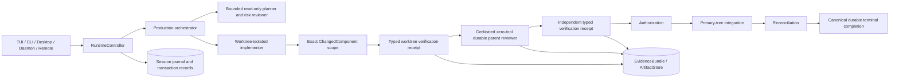

# Medusa Architecture v2 Living Index

This is the change-governance root and final certification record for Medusa architecture v2. Production code and executable tests remain the behavioral authority. [`baseline.json`](baseline.json) records certified ownership, lifecycle, trust boundaries, capability status, and historical migration receipts. [`owners.json`](owners.json) assigns exactly one primary owner to every workspace crate.

## Final certification

Architecture v2 migration is complete. The phase-0 feature freeze is inactive, every production mutation follows one review-before-integration state machine, and no production entrypoint can select the retired conversational review or integrate-before-review compatibility path.

A capability is `certified-production` only when its owner, versioned contract, dispatcher, permissions, conformance evidence, observability, recovery behavior, and supported production entrypoints agree. Bounded browser model actions now have a `certified-production` implementation backed by the production `ToolManager` → `medusa-browserd` dispatcher and cross-platform browser-dispatch certification; their legacy product availability remains `preview` only because activation is explicitly opt-in. Arbitrary browser evaluation remains verifier-internal. Telegram duplex/audio behavior remains quarantined where external behavioral evidence is still incomplete.

## How to use this index

1. Find the capability or deployment mode in `baseline.json`.
2. Resolve its primary component owner in `owners.json`.
3. Follow its dispatcher and implementation path to the real production entrypoint.
4. Follow the related source-of-truth row, state machine, trust boundary, and evidence gate.
5. Record any authority, contract, dependency, persistence, lifecycle, entrypoint, capability, or trust-boundary change in this index and an ADR before merge.
6. Reject any change that creates a duplicate mutable authority or bypasses typed review, verification, authorization, integration, reconciliation, or durable terminal persistence.

## Certified production map

The generic `medusa-agent::AgentEngine` owns bounded planner, risk-reviewer, and implementer model sessions. It does not own parent mutation acceptance. The dedicated reviewer consumes the immutable prepared change, worktree verification, task contract, and evidence, persists typed restart-safe review evidence, and fails closed on tool use, malformed output, provider failure, or corrupt journals.

## Architecture contract

V2 invariants:

- one authoritative owner for every mutable concern;
- no primary-tree integration before an accepted dedicated review receipt and independent verification receipt;
- additions, modifications, renames, deletions, generated files, ownership, and effective UI impact remain explicit through implementation, verification, review, authorization, integration, reconciliation, and evidence;
- verified conclusions resolve typed sources and prove the artifact ranges actually read;
- displayed tasks and workers require durable dispatch and lease evidence;
- an advertised capability requires a dispatcher, permission contract, tests, owner, observability, recovery semantics, and production evidence;
- provider readiness and capability claims equal actual wire and cancellation behavior;
- frontends project commands, events, evidence, and artifacts but do not redefine execution semantics;
- failures and interrupted states remain evidence and are never rewritten as success;
- terminal completion is persisted canonically before process-local completion is emitted.

## Deployment modes and shared path

| Mode | Entry point | Current implementation | Shared authority |
|---|---|---|---|
| Interactive terminal | `medusa` | `crates/medusa-tui` | daemon protocol v2 commands, transient events, artifacts, and canonical replay; terminal-only presentation adapter |
| Headless | `medusa run` | `crates/medusa-cli` | runtime command authority; canonical journal projected through `medusa-protocol` |
| Daemon service | `medusa __daemon-serve` | `crates/medusa-daemon` | protocol v2 routes shared frontend commands and canonical replay batches |
| Desktop | `apps/medusa-desktop` | React/Tauri application | daemon protocol v2 commands, artifacts, transient events, and canonical replay |
| Telegram | `medusa telegram` | `medusa-daemon::telegram` | daemon-client protocol v2 commands, bounded artifacts, canonical replay, and transport-only durable state |
| GitHub operations | `medusa github` / capability entrypoints | `crates/medusa-external-github` over `crates/medusa-github` | versioned attempt-bound operation envelope and normalized receipt |
| Update | `medusa update` | `crates/medusa-update` | Ed25519-verified prebuilt release; explicit `--channel source` developer path |

CLI, TUI, daemon, desktop, and remote adapters share runtime, journal, capability, evidence, cancellation, recovery, and mutation semantics. Telegram microphone/audio and live operator evidence remain separately tracked external certification work; the gateway does not own execution state.

## Capability certification

The versioned runtime authority is `medusa-capabilities::CapabilityRegistry`. Model tools, prompt availability, CLI diagnostics, protocol reports, and generated documentation are projections of one validated snapshot. Historical claim documents are evidence only and do not grant runtime availability.

Executable skill packages are owned by `crates/medusa-skill` and dispatched through `crates/medusa-agent/src/tools/executable_skills.rs`. Packages remain inert until `skills validate` records a digest-bound receipt; execution uses the existing contained process path, temporary package copy, typed scopes, cancellation, and bounded output.

| Capability | Product status | V2 status | Authority / decision | Remaining evidence |
|---|---|---|---|---|
| Shared runtime | production | certified-production | preserve `medusa-runtime::RuntimeController` and one production lifecycle | none |
| Durable sessions and memory | production | certified-production | preserve durable session aggregate and reconstructable projections | none |
| GitHub service | production | certified-production | preserve typed guarded operations and normalized receipts | none |
| Provider/context resilience | production | certified-production | preserve exact route capability and durable health authority | none |
| Identity, approvals, transactions | production | certified-production | preserve typed policy, review, authorization, and transaction receipts | none |
| Evidence, artifacts, verification | production | certified-production | preserve typed source-bound receipts and content-addressed artifacts | none |
| Daemon | production | certified-production | preserve versioned shared frontend protocol and canonical replay | none |
| Release trust | production | certified-production | preserve signed manifest v2, protected signer, and reviewed keyring | none |
| Self-update | production | certified-production | preserve verified prebuilt default and explicit source channel | none |
| Multi-agent execution | production | certified-production | preserve bounded teammates, isolated mutation, dedicated review, and durable completion | none |
| Browser tools | preview | certified-production | readiness-gated `medusa-agent::ToolManager` → stateful `medusa-browserd`; bounded model actions are verification-route-bound and `browser_evaluate` stays internal | none for bounded actions; default activation and broader browser automation remain intentionally out of scope |
| Plugins/extensions | managed | preview | managed manifests and instruction-only `SKILL.md`; executable handlers require certification | handler-specific evidence |
| Telegram remote frontend | partial | quarantined | shared daemon path is authoritative; duplex/audio claims remain withheld | authenticated microphone/audio and live Telegram evidence |
| Unsafe/FFI boundary | production | certified-production | preserve crate-local allowlist and cross-platform containment proof | none |
| TypeScript/JavaScript code intelligence | production read-only; guarded rename under certification | certification-pending | `medusa-intelligence` owns workspace/LSP normalization; `medusa-agent` owns dispatch; `PatchTransaction` owns mutation | final cross-platform and exhaustive issue-closing evidence |

## Source-of-truth matrix

The complete machine-readable matrix is in `baseline.json`. The critical rows are:

| Concern | Production authority | Reconstructable projections | Non-negotiable invariant |
|---|---|---|---|
| Session/transcript | durable session aggregate and canonical journal | frontend transcript projections | presentations do not create history |
| Commands/runtime events | versioned `medusa-protocol` envelope plus canonical journal | process-local transient delivery | every durable mutation has a canonical event |
| Plan/task graph | persisted plan aggregate and immutable task contracts | scheduler and UI views | execution binds to the active fingerprint |
| Worker lifecycle | `WorkerExecutionController` durable aggregate and leases | displayed worker state | visible workers require dispatch and lease proof |
| Mutation | `MutationTransaction` durable state and receipts | human summaries | accepted review and independent verification precede integration |
| Review | dedicated zero-tool durable parent reviewer | review presentation | generic conversational sessions cannot accept mutations |
| Verification | `medusa-evidence::VerificationPlan` and `VerificationReceipt` | human summaries | required checks bind to the exact commit and changed scope |
| Provider route/readiness | selected provider profile plus durable `ProviderHealthStore` | frontend readiness | claims equal actual wire and cancellation behavior |
| Capability availability | generated versioned registry snapshot | model, CLI, UI, protocol, and docs projections | no advertised action lacks certified dispatch |
| Evidence/artifacts | typed `EvidenceBundle` and content-addressed `ArtifactStore` | reports and UI | conclusions resolve exact sources and durable read receipts |
| GitHub operations | guarded attempt-bound operation lifecycle | CLI presentation | credentials never enter receipts |
| Updates/releases | signed manifest v2 and protected signing workflow | release metadata | signature is verified before metadata is trusted |

## Dataflows

- **Session:** frontend command → versioned runtime envelope → session aggregate and journal → durable projection → frontend event.
- **Execution:** plan aggregate → immutable task contract → lease → isolated implementation → changed-path verification → dedicated review receipt → independent verification → authorization → integration → reconciliation → canonical terminal completion.
- **Provider:** selected route → capability preflight → abortable request → normalized response and usage event → durable route-health update.
- **External operation:** typed operation → canonical digest and attempt ID → trusted-host and capability check → adapter dispatch → reconciliation-aware normalized receipt.
- **Evidence:** exact changed components → selected checks → raw command, browser, and artifact outputs → content-addressed artifacts and read receipts → typed claims and decisions → review, scheduler, authorization, integration, report, and UI consumers.
- **Browser:** runtime capability readiness → bounded model browser tool → repository/route-scoped `BrowserClient` → `medusa-browserd` network policy → Playwright → bounded output/artifact; authoritative browser verification remains a separate receipt-producing consumer of the same sidecar infrastructure.
- **Persistence:** every mutable concern identifies one journal or aggregate; caches and UI projections are reconstructable and never authoritative.
- **TypeScript intelligence:** confined target → deterministic workspace discovery and content fingerprints → disposable LSP → normalized semantic result → optional guarded snapshot-bound transaction.

## Trust boundaries

The indexed boundaries are repository mutation, platform containment, unsafe/FFI, secrets, provider network, GitHub OAuth/API, browser sidecar, plugins, and release/update artifacts.

Repository mutation fails closed unless the prepared commit, exact changed-component scope, typed worktree verification, dedicated review, independent verification, authorization, integration, and reconciliation receipts agree. Raw native FFI remains isolated in the allowlisted containment crate. Secrets are excluded from model-visible context and receipts. Browser model actions cannot author verification authority, cannot access arbitrary JavaScript evaluation, and can access loopback only at the exact configured verification origin; public destination pinning remains enforced by the browser proxy. Release metadata is trusted only after Ed25519 signature verification.

## Verified release and update authority

The architecture and state machine are defined in [`PREBUILT-UPDATES.md`](PREBUILT-UPDATES.md) and ADR [`0002-verified-prebuilt-updates.md`](decisions/0002-verified-prebuilt-updates.md). The stable updater verifies an embedded Ed25519 key before trusting manifest metadata, selects one exact OS/architecture archive, verifies signed size and SHA-256, confines extraction, stages beside the running executable, and retains the previous binary until startup acknowledgement.

`medusa update --channel source` is the sole source-build path. It is explicit and is never selected automatically or used as fallback.

## Known-failure compatibility fixtures

There are no architecture-v2 compatibility fixtures. A selectable legacy authority, active migration freeze, generic parent review path, duplicate production execution state machine, or unexpected `legacy-uncertified` status is a certification failure rather than an expected failure.

Product features that still require external evidence remain truthfully `quarantined` or `preview`; they do not gain compatibility exceptions.

## Extension procedure

A new crate, entrypoint, authority, capability, provider route, frontend, persistence record, trust boundary, or dependency edge requires:

1. a baseline entry with owner and current disposition;
2. an exact primary owner in `owners.json`;
3. a versioned contract or an ADR explaining why no contract is needed;
4. dispatcher and least-privilege permission mapping;
5. black-box conformance and supported-platform coverage;
6. observability and recovery semantics;
7. explicit replacement/deletion handling for any superseded authority;
8. architecture-impact declaration in the pull request.

## Migration and deletion

Architecture v2 phases are completed historical receipts:

| Phase | Issues | Completed outcome |
|---|---|---|
| 0 | #646, #653, #655 | inventory and governance, unsafe boundary, verified updater |
| 1 | #647 | foundation contracts |
| 2 | #648 | one orchestration core and state ownership |
| 3 | #649 | transactional review-before-integration mutation lifecycle |
| 4 | #650 | authoritative evidence, artifacts, and changed-component verification |
| 5 | #651 | provider, authentication, cancellation, and external-operation contracts |
| 6 | #652 | production entrypoints on canonical frontend projection |
| 7 | #654 | production certification and final legacy-authority deletion |

Use [`LEGACY-DELETION.md`](LEGACY-DELETION.md) for deletion receipts and [`RELEASE-POLICY.md`](RELEASE-POLICY.md) for release rules. Reopening a completed migration path requires a new ADR and may not restore a deleted authority.

## Decisions, schemas, tests, and runbooks

- Decision: [`decisions/0001-architecture-v2-reset.md`](decisions/0001-architecture-v2-reset.md)
- Decision: [`decisions/0002-verified-prebuilt-updates.md`](decisions/0002-verified-prebuilt-updates.md)
- Decision: [`decisions/0003-truthful-capability-plugin-registry.md`](decisions/0003-truthful-capability-plugin-registry.md)
- Decision: [`decisions/0004-authoritative-durable-scheduler.md`](decisions/0004-authoritative-durable-scheduler.md)
- Decision: [`decisions/0005-transactional-mutation-lifecycle.md`](decisions/0005-transactional-mutation-lifecycle.md)
- Decision: [`decisions/0006-authoritative-evidence-artifacts-and-verification.md`](decisions/0006-authoritative-evidence-artifacts-and-verification.md)
- Decision: [`decisions/0007-canonical-frontend-projection.md`](decisions/0007-canonical-frontend-projection.md)
- Decision: [`decisions/0008-verified-browser-model-actions.md`](decisions/0008-verified-browser-model-actions.md)
- Final independent audit: [`FINAL-CERTIFICATION-AUDIT.md`](FINAL-CERTIFICATION-AUDIT.md)
- Machine-readable certification baseline: [`baseline.json`](baseline.json)
- Primary component owners: [`owners.json`](owners.json)
- TypeScript/JavaScript code-intelligence architecture: [`typescript-code-intelligence.md`](typescript-code-intelligence.md)
- Contributor crate map: [`../CONTRIBUTOR-ARCHITECTURE.md`](../CONTRIBUTOR-ARCHITECTURE.md)
- Capability evidence: [`../CAPABILITY-EVIDENCE.md`](../CAPABILITY-EVIDENCE.md)
- Architecture checker: `python scripts/check-architecture-index.py`
- Adversarial checker fixtures: `python scripts/test-architecture-index.py`
- Headless conformance harness: `python scripts/architecture-conformance.py --all --binary <medusa> --json`

The architecture baseline workflow runs governance checks on Linux, macOS, and Windows.
