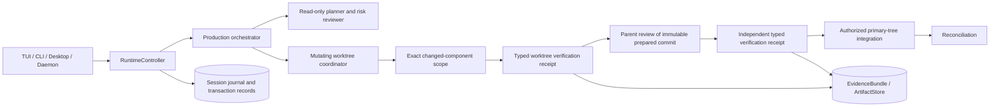
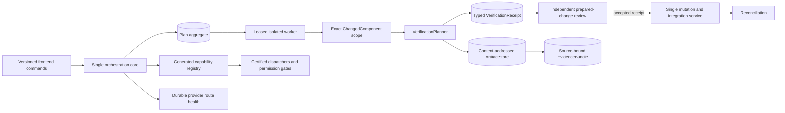

# Medusa Architecture v2 Living Index

This is the change-governance root for Medusa architecture v2. It distinguishes **legacy availability** from **v2 certification**. Production code and executable tests remain the authority for what v1 currently does; [`baseline.json`](baseline.json) is the authority for migration ownership, certification status, state ownership, trust boundaries, and deletion targets. [`owners.json`](owners.json) assigns exactly one primary owner to every workspace crate.

## Phase 0 feature freeze

Major feature expansion is frozen while issues #646–#654 rebuild, migrate, certify, and retire the legacy core. Exceptions are limited to security or data-loss corrections, work required to enable architecture v2, the unsafe/FFI boundary in #653, and the verified prebuilt updater in #655. A release must not advertise a major capability as v2 production unless its owner, versioned contract, dispatcher, permissions, conformance evidence, migration consumer, and legacy deletion target are recorded in `baseline.json`.

## How to use this index

1. Find the capability or deployment mode in `baseline.json`.
2. Resolve its primary component owner in `owners.json`.
3. Follow its dispatcher and implementation path to the real production entrypoint.
4. Find the related source-of-truth row, state machine, trust boundary, and known-failure fixture.
5. Record any authority, contract, dependency, persistence, lifecycle, entrypoint, capability, or trust-boundary change in this index and an ADR before merge.
6. Remove the corresponding legacy path only after migration consumers and rollback evidence are complete.

## Current v1 map

This is the current migration state. Transactional review-before-integration and authoritative evidence are production paths; remaining known defects are tracked in later phases, including provider wire/cancellation parity and shared frontend certification.

## Target v2 map

V2 invariants:

- one authoritative owner for every mutable concern;
- no primary-tree integration before an accepted independent review receipt;
- additions, modifications, renames, deletions, generated files, ownership, and effective UI impact remain explicit through implementation, verification, review, integration, and evidence;
- verified conclusions resolve typed sources and prove the artifact ranges actually read;
- displayed tasks and workers require durable dispatch and lease evidence;
- an advertised capability requires a dispatcher, permission contract, tests, owner, observability, migration consumer, and deletion target;
- provider readiness and capability claims equal actual wire and cancellation behavior;
- frontends project commands, events, evidence, and artifacts but do not redefine execution semantics;
- failures and interrupted states remain evidence and are never rewritten as success.

## Deployment modes and shared path

| Mode | Entry point | Current implementation | Shared authority |
|---|---|---|---|
| Interactive terminal | `medusa` | `crates/medusa-tui` | runtime command authority; canonical journal → `medusa-protocol` TUI projection |
| Headless | `medusa run` | `crates/medusa-cli` | runtime command authority; canonical journal → `medusa-protocol` frontend projection |
| Daemon service | `medusa __daemon-serve` | `crates/medusa-daemon` | daemon protocol v2 routes shared frontend commands; canonical journal → frontend-scoped replay batches |
| Desktop | `apps/medusa-desktop` | React/Tauri application | runtime command compatibility; canonical journal → `medusa-protocol` desktop projection |
| GitHub operations | `medusa github` / capability entrypoints | `crates/medusa-external-github` over `crates/medusa-github` | versioned attempt-bound operation envelope and normalized receipt |
| Update | `medusa update` | `crates/medusa-update` | Ed25519-verified prebuilt release; explicit `--channel source` developer path |

The phase-6 frontend migration is proceeding in production-entrypoint order. Headless CLI and interactive TUI output tail committed session-journal events through `medusa-protocol::frontend`. Daemon protocol v2 now routes the shared frontend command envelope through one daemon-owned control plane and returns typed acknowledgements plus frontend-scoped replay batches with a next canonical cursor that advances through non-presentable events. The TUI and desktop temporarily retain local settings, startup recovery, turn-counter, reset hints, and process-local command compatibility; desktop daemon-command migration and remote voice remain follow-up slices.

## Capability certification

The versioned runtime authority is `medusa-capabilities::CapabilityRegistry`. Model tools, prompt availability, CLI diagnostics, protocol reports, and generated documentation are projections of one validated snapshot. Historical claim documents are migration evidence only and no longer grant runtime availability.

Runtime readiness distinguishes design, experimental, partial, and production behavior. The V2 status below separately records architecture certification, so withheld browser tools remain `quarantined` while managed non-executable plugin support is `preview`.

| Capability | Legacy claim | V2 status | Decision | Blocking evidence |
|---|---|---|---|---|
| Shared runtime | production | legacy-uncertified | replace authority contracts | lifecycle and ownership remain implicit |
| Durable sessions and memory | production | legacy-uncertified | adapt | projections must be separated from authority |
| GitHub service | production | legacy-uncertified | adapt | complete OAuth/backend contract migration |
| Provider/context resilience | production | quarantined | replace | `medusa-external-contracts` and `medusa-external-provider` establish truthful route state; remaining production consumers must migrate |
| Identity, approvals, transactions | production | legacy-uncertified | adapt | centralize mutation receipts and authority |
| Evidence, artifacts, verification | legacy-free-form | certified-production | preserve | typed source-bound receipts and content-addressed artifacts are authoritative |
| Daemon | production | legacy-uncertified | adapt | version daemon/remote contracts |
| Release trust | production | certified-production | preserve | signed manifest v2, protected signer, reviewed keyring, and CI artifacts |
| Self-update | production | certified-production | preserve | verified prebuilt release is default; source compilation is explicit and never a fallback |
| Multi-agent research | production | quarantined | replace | review ordering, decorative state, changed-path loss |
| Browser tools | withheld | quarantined | adapt | registry records remain non-executable until a production handler is certified |
| Plugins/extensions | managed | preview | adapt | versioned manifests and instruction-only `SKILL.md`; executable handlers still require certification |
| Telegram remote frontend | partial | quarantined | adapt | shared-path and operator conformance incomplete |
| Unsafe/FFI boundary | partial | legacy-uncertified | adapt | #653 audit and allowlist |

## Source-of-truth matrix

The complete machine-readable matrix is in `baseline.json`. The critical rows are:

| Concern | Current authority | V2 authority | Non-negotiable invariant |
|---|---|---|---|
| Session/transcript | agent session journal | versioned session aggregate | presentations do not create history |
| Plan/task graph | session plan plus orchestrator contracts | one persisted plan aggregate | execution binds to the active fingerprint |
| Worker lifecycle | `WorkerExecutionController` state | one durable worker aggregate | visible workers require dispatch and lease proof |
| Mutation | worktree manager and transaction receipts | one mutation service | accepted review precedes integration |
| Review | parent review after integration | independent prepared-change review | integration requires an accepted receipt |
| Verification | `medusa-evidence::VerificationPlan` and `VerificationReceipt` | typed changed-component authority | every required check is bound to the exact commit, scope, command outputs, and artifacts |
| Provider route/readiness | configuration plus process-local manager state | `medusa-external-contracts` route readiness consumed through `medusa-external-provider` | claims equal wire behavior |
| External operations | transport-specific requests and receipts | `medusa-external-contracts` envelopes and adapter-normalized receipts | attempts, digests, idempotency, reconciliation, transport identity, and redaction are explicit |
| Capability availability | legacy claims plus UI/docs | generated registry | no advertised action without certified dispatch |
| Evidence/artifacts | `EvidenceBundle` and content-addressed `ArtifactStore` | typed source-bound envelope | conclusions resolve exact sources and durable read receipts |
| Updates/releases | workflows plus source updater | Ed25519-verified prebuilt manifest | no silent source compilation |

## Dataflows

- **Session:** frontend command → runtime command envelope → session journal → durable projection → frontend event.
- **Execution:** plan aggregate → immutable task contract → lease → isolated implementation → changed-path verification → review receipt → integration receipt → repository verification.
- **Provider:** selected route → `medusa-external-provider` capability preflight → abortable request → normalized response/usage event → durable route-health update.
- **External operation:** typed operation → canonical digest and attempt ID → trusted-host/capability check → adapter dispatch → reconciliation-aware normalized receipt.
- **Evidence:** exact changed components → selected checks → raw command/browser/artifact outputs → content-addressed artifacts and read receipts → typed claims/decisions → review, scheduler, authorization, integration, report, and UI consumers.
- **Persistence:** every mutable concern identifies one journal or aggregate; caches and UI projections are reconstructable and never authoritative.

## Trust boundaries

The indexed boundaries are repository mutation, platform containment, unsafe/FFI, secrets, provider network, GitHub OAuth/API, browser sidecar, plugins, and release/update artifacts. #653 and #655 are phase-0 companions: #653 closes the native FFI boundary and #655 closes the signed distribution and rollback boundary without expanding product scope.

## Verified release and update authority

The architecture and state machine are defined in [`PREBUILT-UPDATES.md`](PREBUILT-UPDATES.md) and ADR [`0002-verified-prebuilt-updates.md`](decisions/0002-verified-prebuilt-updates.md). The stable updater verifies an embedded Ed25519 key before trusting manifest metadata, selects one exact OS/architecture archive, verifies signed size and SHA-256, confines extraction, stages beside the running executable, and retains the previous binary until startup acknowledgement. The protected signer consumes only artifacts already produced by release CI. Unsigned releases, unknown or revoked keys, wrong-platform assets, traversal, tampering, truncation, version or rollout rollback, and startup failure fail closed.

`medusa update --channel source` is the sole source-build path. It is an explicit developer exception and is never selected automatically or used as a fallback.

## Known-failure compatibility fixtures

The headless harness intentionally reproduces current defects as expected failures. They document what v1 does, not what v2 should preserve:

- `provider-capability-mismatch` (#636)

An unexpected pass fails the baseline job until the fixture, capability status, migration record, and deletion checklist are updated together.

## Extension procedure

A new crate, entrypoint, authority, capability, provider route, frontend, persistence record, trust boundary, or dependency edge requires:

1. a baseline entry with owner and preserve/adapt/replace/quarantine/delete disposition;
2. an exact primary owner in `owners.json`;
3. a versioned contract or an ADR explaining why no contract is needed;
4. dispatcher and least-privilege permission mapping;
5. black-box conformance and platform coverage;
6. observability and recovery semantics;
7. migration consumers and an explicit v1 deletion target;
8. architecture-impact declaration in the pull request.

## Migration and deletion

| Phase | Issues | Outcome |
|---|---|---|
| 0 | #646, #653, #655 | freeze, inventory, governance, unsafe boundary, verified updater |
| 1 | #647 | foundation contracts |
| 2 | #648 | one orchestration core and state ownership |
| 3 | #649 | transactional mutation, review, verification, and integration lifecycle |
| 4 | #650 | authoritative evidence, artifacts, and changed-component verification |
| 5 | #651 | provider, authentication, cancellation, and external-operation contracts |
| 6 | #652 | migrate every production entrypoint and make frontend state truthful |
| 7 | #654 | certify every real entrypoint and delete the remaining legacy core |

Use [`LEGACY-DELETION.md`](LEGACY-DELETION.md) for deletion gates and [`RELEASE-POLICY.md`](RELEASE-POLICY.md) for freeze and release rules.

## Decisions, schemas, tests, and runbooks

- Decision: [`decisions/0001-architecture-v2-reset.md`](decisions/0001-architecture-v2-reset.md)
- Decision: [`decisions/0002-verified-prebuilt-updates.md`](decisions/0002-verified-prebuilt-updates.md)
- Decision: [`decisions/0003-truthful-capability-plugin-registry.md`](decisions/0003-truthful-capability-plugin-registry.md)
- Decision: [`decisions/0004-authoritative-durable-scheduler.md`](decisions/0004-authoritative-durable-scheduler.md)
- Decision: [`decisions/0005-transactional-mutation-lifecycle.md`](decisions/0005-transactional-mutation-lifecycle.md)
- Decision: [`decisions/0006-authoritative-evidence-artifacts-and-verification.md`](decisions/0006-authoritative-evidence-artifacts-and-verification.md)
- Decision: [`decisions/0007-canonical-frontend-projection.md`](decisions/0007-canonical-frontend-projection.md)
- Verified update architecture: [`PREBUILT-UPDATES.md`](PREBUILT-UPDATES.md)
- Machine-readable baseline: [`baseline.json`](baseline.json)
- Primary component owners: [`owners.json`](owners.json)
- Legacy product map: [`../ARCHITECTURE.md`](../ARCHITECTURE.md)
- Contributor crate map: [`../CONTRIBUTOR-ARCHITECTURE.md`](../CONTRIBUTOR-ARCHITECTURE.md)
- Capability evidence: [`../CAPABILITY-EVIDENCE.md`](../CAPABILITY-EVIDENCE.md)
- Architecture checker: `python scripts/check-architecture-index.py`
- Adversarial checker fixtures: `python scripts/test-architecture-index.py`
- Headless compatibility harness: `python scripts/architecture-conformance.py --all --binary <medusa> --json`

The architecture baseline workflow runs these checks on Linux, macOS, and Windows.
