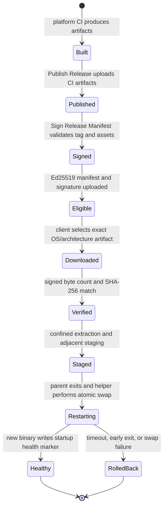

# Verified prebuilt update architecture

## Authority

`medusa update --release` uses the stable GitHub release channel. The default `medusa update` path follows the latest `main` commit through the source updater instead; the two paths are explicit and neither is a fallback for the other.

A release is eligible only when it contains:

- `medusa-release-manifest.json`, using `medusa-release-manifest-v2`;
- `medusa-release-manifest.sig.json`, using `medusa-release-signature-v1`;
- exactly one signed CLI archive for the running operating system and architecture;
- exact signed byte counts and SHA-256 digests for every installable artifact.

The release updater verifies the Ed25519 signature over the exact manifest bytes before parsing or trusting the version, source revision, URLs, platform mapping, sizes, hashes, rollout sequence, minimum updater version, or artifact names. GitHub release metadata is only a transport bootstrap for the two fixed manifest asset names.

The embedded primary, recovery, and revoked-history public keys and their reviewed lifecycle are recorded in `release/keys/keyring.json`. Private keys are not stored in the repository. The independently generated active authorities are provided only through the separately named primary and recovery secrets in the protected `release-signing` environment.

The embedded trust root is compiled as a fixed 32-byte value. Platform discovery is fallible, so an unsupported operating system or architecture fails closed instead of panicking.

## Distribution lifecycle



A newly published release is not update-eligible until `Sign Release Manifest` completes successfully. `medusa update --release` fails closed during that interval because unsigned or incompletely signed releases have no trusted authority. It does not switch to the source updater.

## Update state machine

The verified release CLI path records path-free JSONL phase diagnostics for:

1. release check;
2. manifest verification;
3. download;
4. artifact verification;
5. confined extraction;
6. staging;
7. restart handoff.

The running session remains active through discovery, download, verification, and staging. Daemon shutdown is requested only after a verified candidate exists. The restart preserves `--repo <path> --continue` so the replacement process resumes the same user-visible session.

The detached helper:

- serializes concurrent attempts with `.medusa-update.lock`;
- waits for the current process to exit;
- moves the current executable to an adjacent backup;
- atomically moves the staged candidate into place;
- starts the candidate with `MEDUSA_UPDATE_HEALTH_FILE`;
- waits for the startup acknowledgement;
- deletes the backup only after acknowledgement;
- restores and restarts the previous executable on swap failure, timeout, or early exit.

An interrupted swap is recovered when the target is absent but its adjacent backup remains.

## Platform and archive boundaries

Supported update coordinates are explicit `(operating system, architecture)` values. A release without exactly one matching CLI artifact is rejected. The current schema supports Linux, macOS, and Windows on `x86_64`, plus the contract representation for `aarch64`; release publication must add a corresponding signed artifact before an architecture becomes installable.

Archives are extracted into a private temporary workspace. Absolute paths, parent traversal, links or non-regular executable entries, multiple Medusa executables, empty candidates, duplicate signed artifact names, and artifact names containing path components are rejected.

## Network and cache behavior

Release metadata uses bounded requests and conditional ETag caching. Manifest and signature responses have independent size limits. Artifact downloads are streamed to a partial file, may resume with an HTTP range request, never exceed the signed byte count, and are renamed to the final local name only after streaming size and SHA-256 verification.

No source compilation is used as a fallback for a failed `--release` update. Network failure, unsupported platform, invalid signature, unknown or revoked key, version mismatch, missing artifact, size mismatch, digest mismatch, extraction error, or replacement failure is surfaced as an error and leaves the current binary usable.

## Rollout and downgrade policy

The signed manifest contains a monotonically increasing rollout sequence and a rollout percentage. Cohort selection is deterministic per repository path. A candidate below the installed sequence is rejected unless the operator explicitly passes `medusa update --release --allow-downgrade`. A semantic-version downgrade also requires that release-only flag.

Key rotation uses explicitly bounded sequence windows in `release/keys/keyring.json`. A replacement key must be embedded and active before a release uses it. Revoked keys are rejected even when the signature is cryptographically valid. The policy and CI require independently referenced primary and recovery authorities with at least two overlapping release sequences before either active authority may be retired.

## Main-branch source path

The default updater path is:

```text
medusa update
```

It resolves the latest `main` commit, invokes Cargo, and compiles locally. `medusa update --check` checks that moving target without modifying the installation. This path does not inspect release manifests and is never selected as a fallback after a failed `medusa update --release`.

The stable verified prebuilt path is selected only with:

```text
medusa update --release
```

Keeping the trust models separate means an unsigned or malformed release cannot alter the behavior of the default main-branch updater, and a source-build failure cannot silently redirect the user to a release.

## Verification

`.github/workflows/verified-prebuilt-update.yml` runs on Linux, macOS, and Windows and checks:

- canonical release evidence and Ed25519 signing fixtures;
- valid, tampered, unknown-key, revoked-key, rotation-window, downgrade, wrong-platform, and traversal cases;
- exact artifact size and digest verification;
- archive confinement and concurrent-update rejection;
- health-check and rollback script contracts;
- CLI default-main and explicit-release behavior;
- formatting and Clippy.

`.github/workflows/sign-release-manifest.yml` is the production signing path. It downloads only artifacts already produced by release CI, regenerates the canonical manifest from those bytes, signs it in the protected environment, verifies it against the repository public key, attests the manifest authority, and uploads the manifest, signature, and checksum inventory to the existing release.
