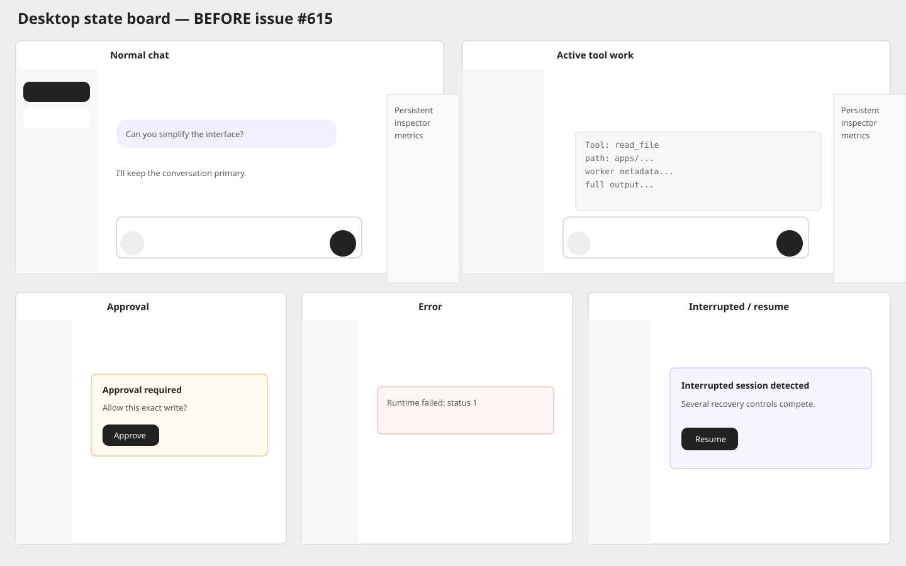
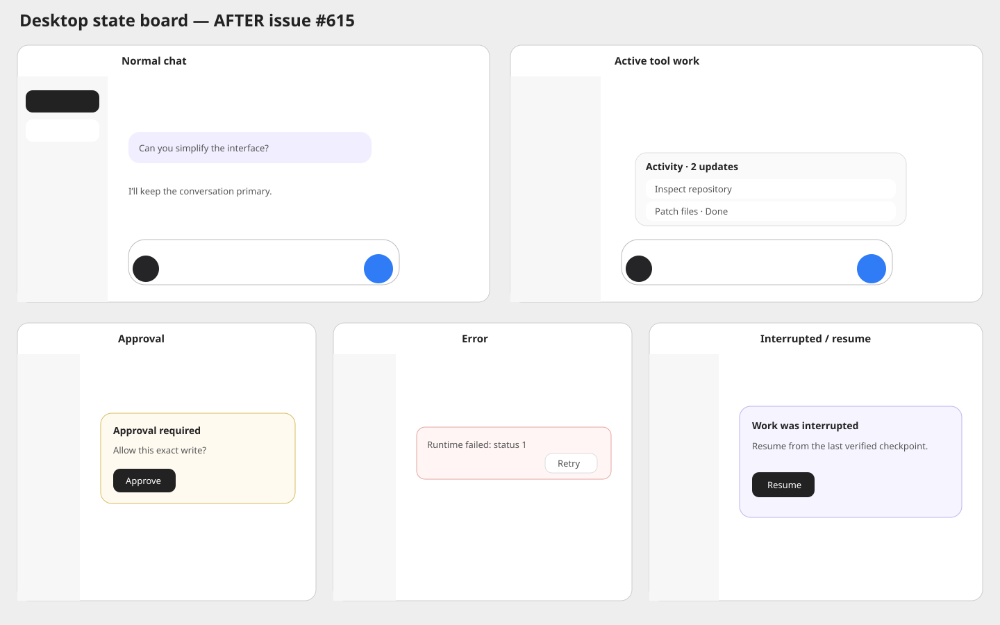
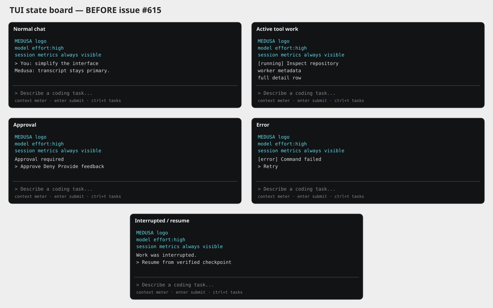
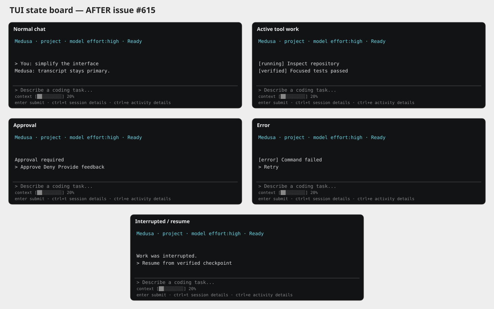

# Issue 615 — conversation-first desktop and TUI

These deterministic before/after state boards cover the acceptance states for the focused UI implementation:

- normal chat
- active tool work
- approval
- error and retry
- interrupted work and resume

## Desktop

The after board reflects the implemented two-column layout, collapsible session rail, on-demand session details, collapsed activity rows, shared typography/radius tokens, consolidated rail actions, and circular composer controls.

## TUI

The after board reflects the implemented one-line session header, transcript-first layout, compact composer, and session metrics and plan details disclosed with `Ctrl+T`, while the compact context meter remains visible as a status row.

The boards are deterministic acceptance-state captures rather than recordings of a live backend session, so they can be reviewed consistently across platforms and regenerated without exposing repository or credential data.
